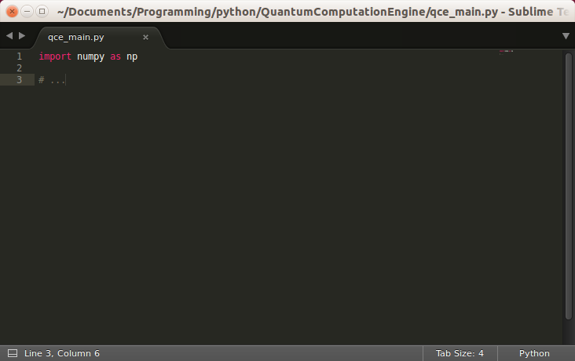
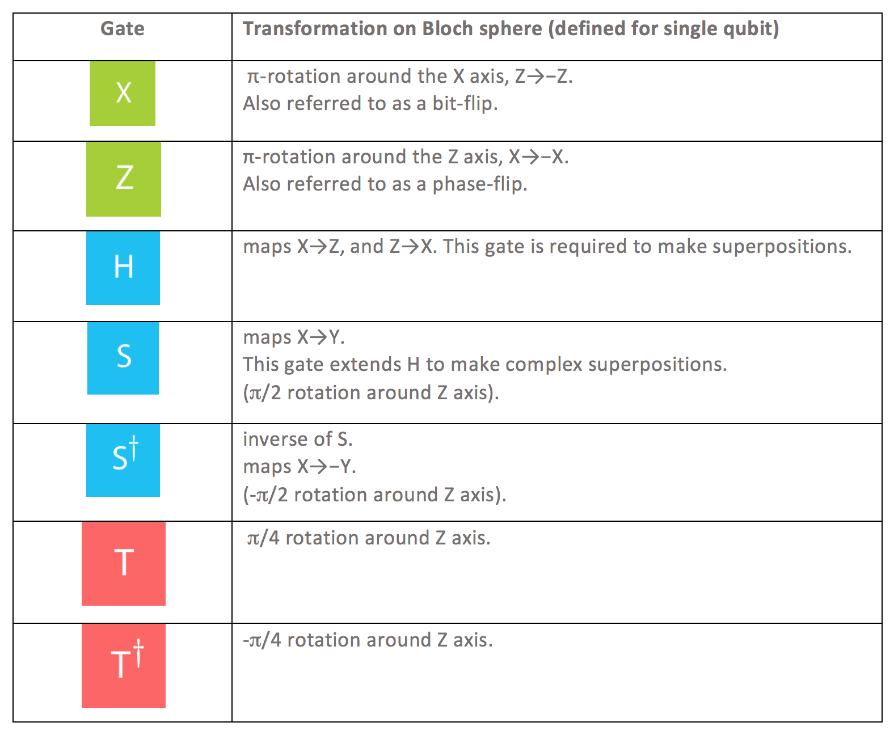

# QuantumComputationEngine
The Quantum Computation Engine (QCE) is my experimental quantum-computation simulator. I will build it from the ground up to learn about quantum computing and to experiment with it. My goal is to create a high efficiency simulator that is CUDA powered for maximum computation speed. I will start by supplying a couple of resources, if you are interested.

<b>!This is not actively being worked on at the moment, not enough time!</b>

# Resources
Very well constructed overview and intuition about the math and concept of quantum computation (qc):<br/>
https://www.youtube.com/watch?v=X2q1PuI2RFI&list=PL1826E60FD05B44E4&t=307s&index=1
<br/>

An in-depth course on the math behind quantum computation: <br/>
https://www.youtube.com/watch?v=X2q1PuI2RFI&list=PL1826E60FD05B44E4&t=307s&index=1
<br/>

Python implementation by the genius Siraj, using the IBM QISKit lib: <br/>
https://www.youtube.com/watch?v=LhtnECml-KI
<br/>

More about the physics behind the hardware implementation by Veritasium:<br/>
https://www.youtube.com/watch?v=IcrBqCFLHIY&list=PLkahZjV5wKe_dajngssVLffaCh2gbq55_
<br/>
<br/>
# All beginnings are humble


# Quantum Gates
Like in classical computing you have a couple of logic gates from which you can derive any mathematical function or algorithm there is.
Similarly in quantum computing you have quantum gates that performe operations on the underlying qbits.



# Rigetti Installation
Installing https://github.com/rigetti/pyquil
    *https://github.com/rigetti/quilc
    *https://github.com/rigetti/qvm

```Download Forest SDK
wget http://downloads.rigetti.com/qcs-sdk/forest-sdk-2.15.1-linux-deb.tar.bz2
7z x forest-sdk-2.15.1-linux-deb.tar.bz2
7z x forest-sdk-2.15.1-linux-deb.tar
cd forest-sdk-2.15.1-linux-deb
chmod 755 forest-sdk-2.15.1-linux-deb.run
./forest-sdk-2.15.1-linux-deb.run```
